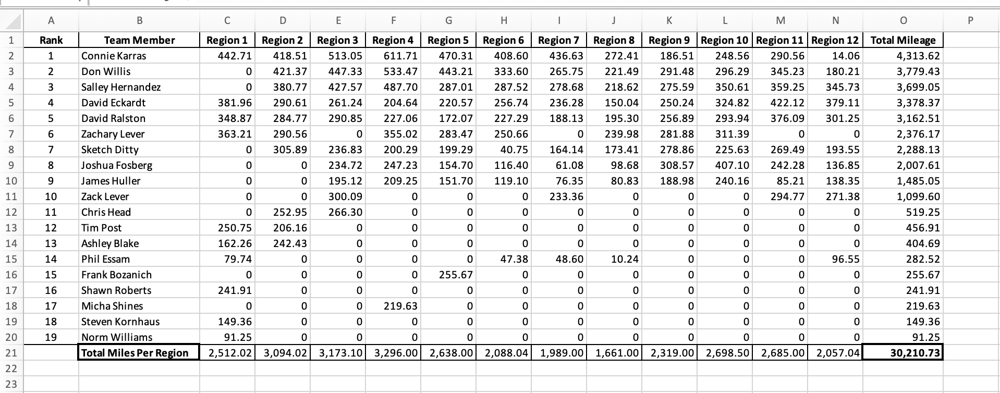
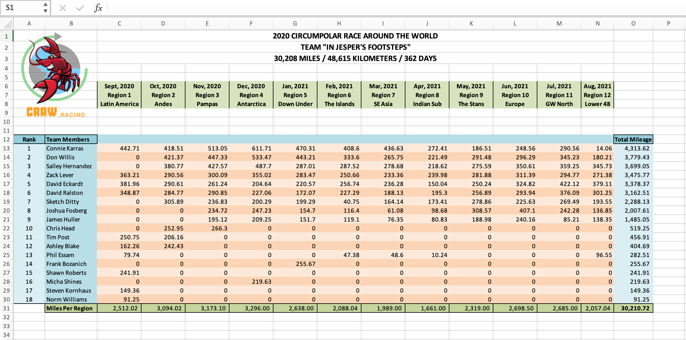

# Circumpolar Race Around the World - Spreadsheet Generator

## Overview
The **Circumpolar Race Around the World** (CRAW) is a virtual relay-race event where participants form teams of 10 and challenge themselves to walk or race across 30,167 miles (48,550 kilometers) in the span of one year. Each team member's daily activity counts towards their team goal of completing 30,167 miles, cumulatively. Participants upload their daily activity [here](https://runsignup.com/Race/CHH/AnywhereAnyPlace/CircumpolarRaceAroundtheWorld).

The [**CRAW spreadsheet generator**](https://circumpolar-race-fa0c42a71788.herokuapp.com/) is a web app, now available to visit.

It does the following:
* prompts user to enter a team name from a running group
* exports an Excel spreadsheet summarizing and ranking the results of participants in this team

An example output spreadsheet:

An example output spreadsheet with color + headers + deduplication
(implementation still a WIP):

This webpage was created to commemorate the team, *In Jesper's Footsteps*.

Data for this team's output is sourced [here](https://runsignup.com/RaceGroups/95983?groupName=In+Jesper%27s+Footsteps).

<!-- ## Technical details -->

## Development Requirements
*For a full list, see the `requirements.txt`*
* Bs4
* Flask
* Openpyxl
* Pandas
* Python 3.9+
* Requests

## Developement
Run the app: `$ python app.py`

Test the app: `$ python -m unittest app_test.py`
